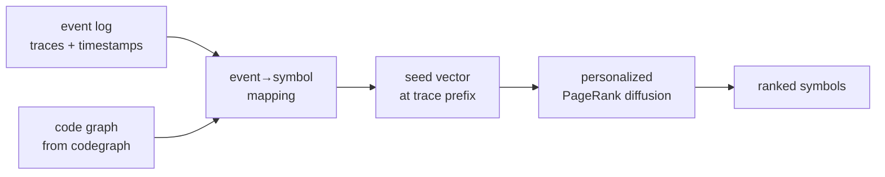

<div align="center">

# `pm-rag`

### process-aware retrieval

**Given a trace step, return the code that runs.**

[](./LICENSE)
[](#roadmap)
[](#install)

</div>

Retrieval over code, conditioned on the *process state* the user is in.
Couples a code graph (AST · calls · types · imports) with an event log,
runs personalized PageRank seeded by the current trace prefix, and
returns the symbols / files / regions most likely to fire next.

## Why

Embedding-based RAG retrieves what's textually similar to the query string. For code search at runtime that's often the wrong question. The interesting question is what code is *about to fire*, given where the running system is. Process-mining traces describe the current state of execution. Code graphs describe what could happen. Diffusing trace state through a code graph picks out the symbols most likely to be touched next, and that's what an agent or a debugger usually wants.

---

## ✦ Worked failure mode

You're at step 14 of an order-fulfillment workflow. The event is
`payment_settled`. Embedding RAG, queried with "payment_settled", will
return:

- The function `pay_payment_settled_handler` - good.
- The Stripe `PaymentSettled` webhook documentation - useful.
- A blog post titled "5 things to do when payment is settled" - noise.
- A test file mocking `payment_settled` - semi-useful.
- A docstring discussing payment settlement - also noise.

What you actually wanted to know: *what code is about to fire?*
Probably one of `generate_invoice`, `allocate_inventory`, `fraud_review`,
or `refund_initiated`. Embedding similarity has no idea, because it's
not looking at the trace; it's looking at the string `"payment_settled"`.

`pm-rag` looks at the trace.

## ✦ How



Three pieces:

1. **Code graph.** Nodes are functions / classes / files; edges are
   calls, imports, type references. We use [`codegraph`](https://github.com/erphq/codegraph)
   for v0; any compatible graph works.
2. **Event-to-symbol mapping.** Which functions emit which events. This
   is the hard part (see below).
3. **PPR diffusion.** Personalized PageRank seeded by the current
   trace prefix. Restart probability biases the walk toward the seed;
   the resulting score is "probability of arriving at this node from
   the current state."

## ✦ Worked example

Trace prefix: `[order_received, payment_settled]`.

```bash
pm-rag query --trace "order_received,payment_settled" --k 5
```

Output:

```text
1. handlers.fulfillment.allocate_inventory          score 0.412
2. handlers.invoicing.generate_invoice              score 0.381
3. fraud.detector.evaluate                          score 0.097
4. webhook.stripe.replay_settled                    score 0.061
5. cron.cleanup.purge_pending                       score 0.018
```

Embedding RAG with the same query "payment_settled" returns:

```text
1. webhooks.stripe.payment_settled_handler          (similarity 0.92)
2. tests.payment.test_settled                       (similarity 0.87)
3. docs.PAYMENTS.md                                 (similarity 0.83)
4. handlers.invoicing.generate_invoice              (similarity 0.71)
5. utils.money.format_amount                        (similarity 0.68)
```

Different rankings, different intent. `pm-rag` ranks by what fires next,
not what's textually related.

## ✦ The hard part: event-to-symbol mapping

The diffusion is well-studied; the bottleneck is figuring out which
function in the codebase emits a given event. Most codebases don't emit
structured events at all, so the mapping has to be inferred from logger
calls, span names, function names, and string constants.

`pm-rag` ships several mapping strategies, composable:

| Strategy | How | When to use |
|---|---|---|
| Regex | Match log strings to function names | Codebases with consistent logging |
| Embedding | Cosine similarity event-name ↔ function-name | Modest codebases, fuzzy matches OK |
| LLM-assisted | LLM proposes mappings, human confirms | High-stakes mappings, small N |
| Manual | YAML override | When all else fails |

You almost always want to compose: regex first (cheap, high precision),
embedding to fill gaps, LLM for the long tail.

## ✦ The math

Given:

- Code graph `G = (V, E)` with `|V| = n` symbols
- Event-to-symbol mapping `m: events → V`
- Trace prefix `t = [e_1, ..., e_k]`

Build seed vector `s ∈ R^n` where `s[v] = 1/|m^{-1}(t_k)|` for
`v ∈ m^{-1}(t_k)`, zero elsewhere.

Compute personalized PageRank with restart probability `α`:

```
r = α s + (1 - α) P^T r
```

where `P` is the row-normalized transition matrix of `G`. Iterate to
convergence. Rank by `r`. Done.

The restart bias is what makes this *personalized* - without it, you
get global PageRank, which doesn't depend on the trace.

## ✦ Comparison

| | Embedding RAG | BM25 | LSP / cscope | `pm-rag` |
|---|---|---|---|---|
| Conditioned on trace | ✗ | ✗ | ✗ | ✓ |
| Conditioned on graph structure | ✗ | ✗ | ✓ | ✓ |
| Captures runtime causality | ✗ | ✗ | ✗ | ✓ |
| Cold-start | Fast | Fast | Slow (indexing) | Slow (graph + log) |
| Best for | "What's similar to X?" | Keyword search | "Who calls X?" | "What fires after X?" |

These are complementary, not competitive. `pm-rag` slots in where you
need *temporal* / *causal* retrieval and the others fall short.

## ✦ When NOT to use this

- Your codebase doesn't emit events that map to a process model. Then
  there's no trace to condition on.
- You want classic search ("show me the file that defines `User`").
  Use grep, LSP, or embedding RAG.
- You want a one-shot query without context. PPR's value is in the
  conditioning; without it, embedding similarity is fine.
- Your event log is shorter than ~100 traces. PPR needs structure to
  diffuse through.

## ✦ Eval

Evaluation is via [`pm-bench`](https://github.com/erphq/pm-bench)'s
next-event localization task:

> Given a trace prefix and a code repo, retrieve the function that
> emits the next event. Score: top-k accuracy.

Baseline: BM25 over function names. Embedding RAG comes next.
`pm-rag`'s job is to beat both.

The eval harness ships in v0.4. Run it on the bundled demo:

```bash
$ pm-rag eval
{
  "task": "next-event-localization",
  "n": 42,
  "alpha": 0.15,
  "top_k": {"1": 0.3095, "3": 0.7143, "5": 0.9524, "10": 1.0}
}
```

Wire it to a real repo + log via the `evaluate(index, cases)` API in
`pm_rag.eval`; `extract_cases(traces)` builds `(prefix, next_event)`
pairs from any iterable of traces.

## ✦ Status

This is research-preview. The diffusion math works on toy examples;
the event-to-symbol mapping is fragile. Open the issues, follow the
benchmarks, expect breakage.

## ✦ FAQ

**Q: Does this work for non-Python codebases?**
A: v0 is Python and TypeScript via `codegraph`. Other languages need a
graph extractor; the diffusion is language-agnostic.

**Q: Can I bring my own code graph?**
A: Yes - pass anything that exposes `(nodes, edges, weights)`. The
`codegraph` integration is optional.

**Q: Can I bring my own event log format?**
A: Yes - adapter for XES, CSV, custom JSON. Same as `pm-bench`.

**Q: Why graph diffusion and not GNN-based retrieval?**
A: Diffusion is parameter-free, deterministic, and trivial to debug.
GNN-based retrieval is on the roadmap (v0.7+) for cases where the
diffusion plateaus.

**Q: How does this compose with `gnn`?**
A: `gnn` predicts the next event distribution; `pm-rag` localizes that
distribution into code. They stack: `gnn → top-k events → pm-rag →
top-k symbols`.

## ✦ Non-goals

- General-purpose RAG framework
- Inventing new graph algorithms (use known ones, apply them well)
- LLM-from-scratch mapping - we layer on top, not replace
- Real-time indexing (batch only for v0)

## ✦ Roadmap

- [x] v0.0 - scaffold, design, math
- [x] v0.1 - regex event→symbol mapping
- [x] v0.2 - joint graph builder (CodeGraph + event vocabulary → P^T)
- [x] v0.3 - personalized PageRank diffusion + ranked query
- [x] v0.4 - eval harness (`evaluate`, `extract_cases`, `pm-rag eval` CLI)
- [x] v0.5 - embedding-based event→symbol mapping (user-supplied embedder via `EmbedFn`) + `compose_mappings` for stacked strategies
- [x] v0.6 - LLM-assisted mapping (user-supplied `LlmFn`); composes under `compose_mappings` as a long-tail fallback
- [ ] v0.7 - GNN-augmented retrieval (research)
- [ ] v1.0 - beats embedding-RAG by ≥10pp on the next-event localization task

## ✦ Topics

`rag` · `retrieval-augmented-generation` · `process-mining` ·
`code-search` · `graph-neural-networks` · `personalized-pagerank` ·
`code-graph` · `ai-agents` · `python` · `event-logs`

## ✦ License

MIT - see [LICENSE](./LICENSE).
