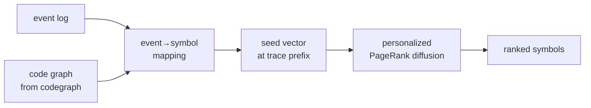

<div align="center">

# `pm-rag`

### process-aware retrieval

**Given a trace step, return the code that runs.**

[](./LICENSE)
[](#roadmap)
[](#install)

</div>

Retrieval over code, conditioned on the *process state* the user is in.
Couples a code graph (AST · calls · types · imports) with an event log,
runs personalized PageRank seeded by the current trace prefix, and
returns the symbols/files most likely to fire next.

> **The thesis.** Embedding-based RAG retrieves what's *similar*. Most
> of the time you don't want similar — you want what's *next*, given
> where the system is. Process-mining traces tell you where the system
> is. Code graphs tell you what could happen. Diffusing the trace state
> through the code graph tells you what's about to happen, and where to look.

---

## ✦ The pitch

You're at step 14 of an order-fulfillment workflow. The event is
`payment_settled`. The next event will be one of `{generate_invoice,
allocate_inventory, fraud_review, refund_initiated}` — but only one
fires, and the code that fires is buried somewhere in 200k LOC.

`pm-rag` ranks code regions by:

1. Edge weights from the event log (which next-events follow `payment_settled`)
2. Symbol-to-event mappings (which functions emit which events)
3. Personalized PageRank diffusion through the code graph

Output: a ranked list of files / symbols / regions, with probabilities.

## ✦ How



## ✦ Usage

```bash
pip install pm-rag
pm-rag index --code ./repo --log events.csv         # build the joint graph
pm-rag query --trace "order_received,payment_settled" --k 20
```

## ✦ Why this is hard

The hard part isn't the diffusion — it's the event-to-symbol mapping.
Most codebases don't emit structured events; you have to *infer* the
mapping from logger calls, span names, function names, string constants.
`pm-rag` ships several mapping strategies (regex, embedding, LLM) and
lets you compose them.

## ✦ Status

Research-preview. The diffusion math works on toy examples; the
event-to-symbol mapping is fragile. Open the issues, follow the
benchmarks, expect breakage.

## ✦ Roadmap

- [ ] v0.1 — event→symbol mapping via regex + embedding
- [ ] v0.2 — joint graph builder (codegraph + event log → unified graph)
- [ ] v0.3 — personalized PageRank diffusion
- [ ] v0.4 — eval harness against pm-bench's next-event task
- [ ] v0.5 — LLM-assisted mapping refinement
- [ ] v1.0 — beats embedding-RAG on the next-event localization task

## ✦ License

MIT — see [LICENSE](./LICENSE).
